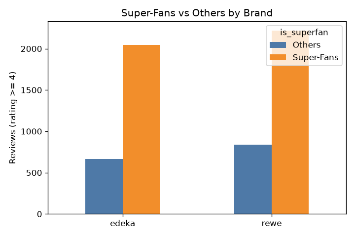
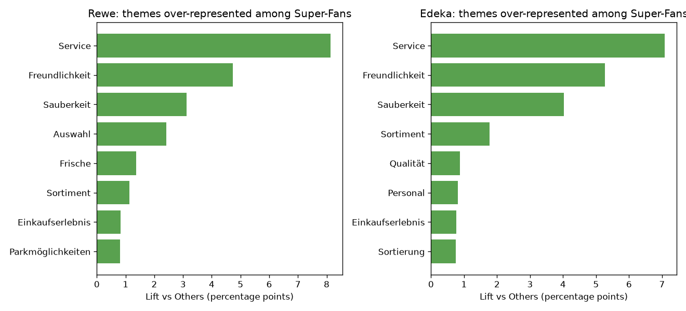
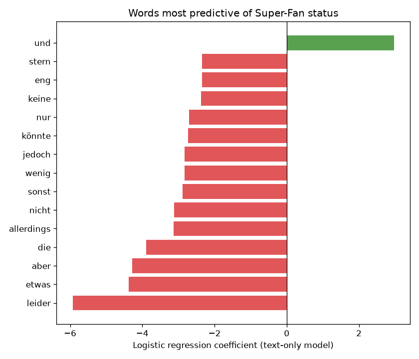
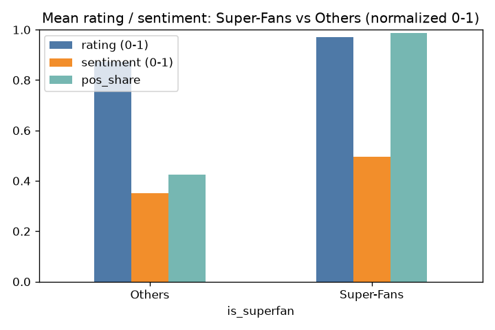

# Super-Fans

Identifies "Super-Fan" reviewers among REWE and EDEKA supermarket reviews and
renders an HTML dashboard comparing them against other positive reviewers, by
theme, city, and predictive language.

A review is scored from its star rating, VADER sentiment, and (if present)
labeled sentiment share; reviews scoring `>= 0.75` are flagged as Super-Fans.

## Project layout

```
.
├── src/superfans_analysis.py   # the pipeline: clean -> score -> dashboard
├── data/raw/                   # source .xlsx exports (not generated, keep as-is)
├── data/processed/             # generated CSVs + cleaned REWE cache (safe to delete)
├── output/dashboard/           # generated HTML dashboard (safe to delete)
├── results/                    # generated PNG charts, tracked in git (see Key Findings)
├── docs/                       # term paper documents
├── unrelated-rf-simulation/    # unrelated 5G/RF signal script, not part of this pipeline
└── requirements.txt
```

## Setup (Windows / PowerShell)

```powershell
python -m venv .venv
.\.venv\Scripts\Activate.ps1
pip install -r requirements.txt
```

If PowerShell blocks the activation script, run once:
`Set-ExecutionPolicy -Scope CurrentUser RemoteSigned`

## Run

```powershell
.\.venv\Scripts\Activate.ps1
python src\superfans_analysis.py
```

This regenerates `data/processed/*.csv` and `output/dashboard/index.html`,
starts a local server, and opens the dashboard at `http://localhost:8000/`.
Press Enter in the terminal to stop the server.

## Results

- `data/processed/rewe_superfans.csv`, `data/processed/edeka_superfans.csv` —
  **the results**: only the reviews identified as Super-Fans, one row each,
  sorted strongest first by `sf_score`.
- `data/processed/rewe_4plus_reviews.csv`, `data/processed/edeka_4plus_reviews.csv`
  — every review with rating ≥ 4 (Super-Fans and Others), with the
  `is_superfan` flag, for anyone who wants the full comparison set.

All CSVs use decimal commas (`0,928`) and 3 decimal places, matching a
German-locale Excel.

## Data

`src/superfans_analysis.py` expects two files in `data/raw/`:
- `rewe_store_reviews_main_topic.xlsx`
- `edeka_store_reviews_main_topic.xlsx`

`data/raw/rewe_store_reviews_main_topic.xlsx` has duplicate columns per
language; on first run the script picks the most-English variant of each and
caches it to `data/processed/rewe_en.xlsx`. Delete that cache file if the raw
REWE export changes and needs re-cleaning.

## Notes on methodology

- The "Top Predictive Words" section in the dashboard is fit on review *text*
  (TF-IDF + logistic regression), deliberately independent of the
  `rating`/`vader`/`pos_share` columns that define the Super-Fan score itself
  — using those as model features would just recover the label's own
  definition rather than surface a real pattern.
- "Others" means 4-5 star reviewers who scored below the 0.75 Super-Fan
  threshold, not negative reviewers — the dataset is pre-filtered to
  `rating >= 4` before the Super-Fan split.

## Key Findings

Based on 3,061 REWE and 2,707 EDEKA reviews with a rating of 4 or higher.

**Super-Fan rate.** 72.5% of qualifying REWE reviewers (2,220 of 3,061) and
75.5% of qualifying EDEKA reviewers (2,044 of 2,707) cross the 0.75
Super-Fan threshold.



**What separates Super-Fans by theme.** For both brands, the themes most
disproportionately mentioned by Super-Fans (vs. Others) are **Service**,
**Freundlichkeit** (friendliness), and **Sauberkeit** (cleanliness) — staff
and store experience drive Super-Fan status more than product range or price.



**What separates Super-Fans by language.** A text-only model (independent of
the score's own inputs) finds hedging/qualifying words — *leider*
(unfortunately), *aber* (but), *jedoch*/*allerdings* (however), *nicht*
(not), *nur* (only) — are the strongest signals of a review belonging to
"Others" rather than a Super-Fan, even though both groups gave 4-5 stars.
In other words, Others tend to soften a positive rating with a caveat;
Super-Fans state the positive without qualification.



**Rating vs. sentiment gap.** Super-Fans and Others are close on star rating
alone (both mostly 4-5 stars, by construction), but diverge much more on
free-text sentiment (VADER) and positive-label share — the score's weighting
toward sentiment (60%) over rating (40%) is what separates the two groups,
not the star rating itself.



## Limitations

- **Definitional threshold.** The 0.75 Super-Fan cutoff and the
  40/35/25 rating/pos_share/vader weighting are manually chosen, not fit or
  validated against an external ground truth (e.g. actual repeat-purchase or
  loyalty-program data) — a different threshold or weighting would shift the
  ~72-75% Super-Fan rate reported above.
- **Language detection on short text.** `langdetect` is less reliable on
  short reviews, so some misclassified-language reviews may be silently
  dropped (only `en`/`de` are kept).
- **VADER is English-tuned.** Sentiment scores for German-language reviews
  come from an English sentiment lexicon; German negation and hedging words
  (as surfaced in the predictive-words chart above) aren't scored the way a
  German-native sentiment model would.
- **Pre-filtered baseline.** The whole analysis only considers reviews rated
  4 or higher, so "Others" means positive-but-not-Super-Fan reviewers, not
  unhappy customers — this is a comparison within already-satisfied
  customers, not satisfied vs. dissatisfied.

## License

[MIT](LICENSE)
